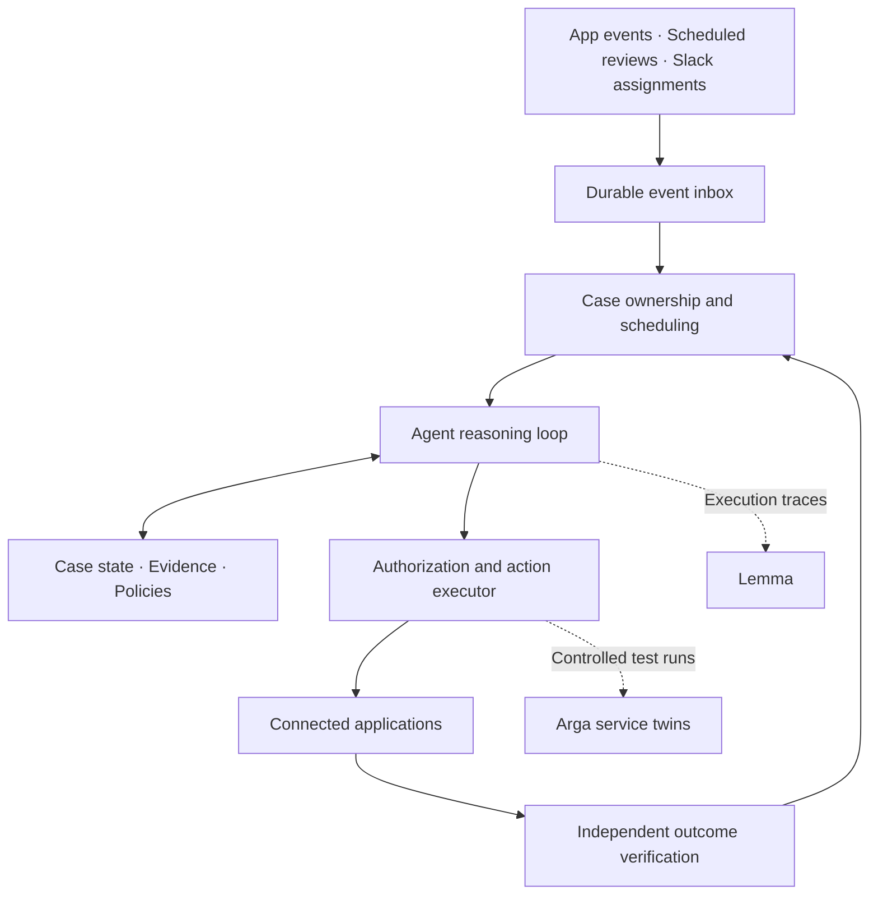

# Peeblo agent architecture

Saved 13 September 2026 from the user's spec. This is the target backend design; the repo currently contains only the frontend prototype (`frontend/`, imported from Manthan). Build against this document.

**Peeblo should own accounts receivable and billing operations as a continuing responsibility: prepare accurate invoices, remove payment blockers, reconcile incoming money, and keep following up until each case reaches a verified outcome.** The Eastbridge demo should emerge naturally from those capabilities.

Based on the product and documentation research below, this is the architecture I would build as of September 2026. It describes the proposed backend; our existing project is still the frontend prototype.

The strongest product references support this broader scope. [Rex](https://www.rex.inc/resources/ai-ar/how-ai-agents-work-accounts-receivable) describes an agent that observes account state, chooses actions under policy, and responds to subsequent outcomes. [LedgerUp](https://www.ledgerup.ai/docs/automated-invoicing) connects invoice preparation to contracts, CRM information, and usage. [Alguna](https://blog.alguna.com/accounts-receivable-ai-agent/) explicitly handles promises to pay, disputes, document requests, and changing contacts. [Fazeshift](https://www.fazeshift.com/product) spans billing, cash application, collections, and disputes.

The common opportunity is **ongoing ownership of work that crosses systems and takes multiple attempts, decisions, and days to finish.**

## Start by giving Peeblo a job and a portfolio

When a company connects Peeblo, it assigns responsibilities: which legal entities, customer accounts, currencies, and billing processes it owns. It also supplies approved policies, escalation contacts, communication preferences, and spending or adjustment authority.

Its instruction might be:

> Own receivables for our US subscription business. Detect missing or inaccurate invoices, investigate overdue balances, manage payment promises, and reconcile received payments. Perform authorized corrections, escalate decisions outside your authority, and maintain evidence and a next action for every unresolved case.

That instruction persists across sessions. A Slack tag can introduce work, but Peeblo also finds work through events, deadlines, and periodic account reviews.

## The applications provide different capabilities and different kinds of truth

| Application | Peeblo’s access and responsibility |
|---|---|
| **Stripe** | Inspect subscriptions, invoices, payments, and credits; prepare and issue invoices; execute authorized billing corrections. |
| **QuickBooks** | Inspect accounting balances, payments, credit memos, and allocations; reconcile authorized changes against the ledger. |
| **Salesforce** | Retrieve commercial ownership, opportunities, account relationships, and configured contractual information. |
| **HubSpot** | Retrieve billing conversations, contacts, account activity, and associations; update operational context and follow-up tasks. |
| **Slack** | Receive assignments, request decisions, coordinate with account owners, and report outcomes in persistent threads. |
| **Notion** | Retrieve approved billing policies, collection rules, escalation procedures, and operating instructions. |
| **Jira** | Coordinate disputes, billing defects, and engineering dependencies that require another team. |
| **Dropbox** | Retrieve executed contracts, amendments, purchase orders, remittances, and supporting documents with version information. |

These roles follow the documented capabilities of [Stripe](https://docs.stripe.com/invoicing/integration/workflow-transitions), [QuickBooks](https://blogs.a.intuit.com/2018/09/10/quickbooks-online-api-best-practices/), [Salesforce](https://developer.salesforce.com/docs/platform/api-rest/guide/dome-upsert.html), [HubSpot](https://developers.hubspot.com/docs/api-reference/legacy/crm/using-object-apis), [Slack](https://docs.slack.dev/reference/methods/chat.postMessage/), [Notion](https://developers.notion.com/reference/capabilities), [Jira](https://developer.atlassian.com/cloud/jira/platform/webhooks/), and [Dropbox](https://developers.dropbox.com/dbx-file-access-guide).

Salesforce and HubSpot are optional, overlapping sources. A customer using both must specify which owns each field. Peeblo must also discover existing integrations: if Stripe already synchronizes invoices into QuickBooks, creating another accounting invoice would duplicate the sale.

## Its work should cover a broad, coherent set of responsibilities

These are proposed capabilities, with natural application combinations. They are examples of what the agent can assemble—not twenty fixed execution scripts.

| Responsibility | Example coordination and outcome |
|---|---|
| 1. Prepare new customers for billing | CRM + Dropbox → verify entity, terms, and contact before creating billing records. |
| 2. Find deals that never became invoices | Salesforce or HubSpot + Stripe → investigate missing billing after a closed deal. |
| 3. Validate draft invoices | Stripe + executed contract → catch incorrect prices, dates, quantities, or discounts. |
| 4. Resolve missing purchase orders | CRM + Dropbox + Slack → obtain the required PO and unblock invoicing. |
| 5. Process approved contract changes | Dropbox + Stripe + QuickBooks → apply effective dates and preserve accounting consistency. |
| 6. Repair incorrect billing identities | CRM + signed documents + billing system → correct the authorized entity or contact. |
| 7. Investigate failed payments | Stripe → distinguish payment failure, retry status, and cases needing intervention. |
| 8. Prioritize collections | Accounting aging + CRM context → maintain an actionable queue with reasons and deadlines. |
| 9. Send appropriate reminders | Billing system + customer communication channel → check current payment and dispute state first. |
| 10. Track promises to pay | Customer conversation + accounting → wait until the promised date, then reassess. |
| 11. Investigate “already paid” claims | Remittance evidence + payment records → locate the money or request missing information. |
| 12. Apply incoming cash | QuickBooks + remittance evidence → allocate payments to the correct invoices. |
| 13. Handle partial and grouped payments | Accounting + customer references → distinguish valid allocations from unexplained shortfalls. |
| 14. Coordinate disputes | Contract + invoice + Jira → assemble evidence and involve the responsible team. |
| 15. Prepare credits or reissues | Billing + policy + approval channel → execute the authorized correction and verify it. |
| 16. Answer billing questions | Invoice + contract → provide an evidenced answer or identify a genuine dispute. |
| 17. Prepare account statements | QuickBooks, with Stripe where needed → produce an accurate outstanding-balance summary. |
| 18. Detect synchronization failures | Stripe + QuickBooks → identify missing or inconsistent records and recover safely. |
| 19. Manage stalled dependencies | Jira + Slack → follow up with owners and resume when a blocker clears. |
| 20. Produce a daily AR briefing | Case portfolio + accounting → report collected cash, blocked revenue, promises, and decisions needed. |

Customer email, procurement portals, raw usage, and some bank information require additional connectors. For example, submitting to Coupa needs access to Coupa; calculating usage charges needs an authoritative usage feed. The architecture should accept these capabilities as they become available.

## The cloud architecture should separate business memory, reasoning, and execution

I would use a TypeScript API and worker service, managed PostgreSQL, encrypted document storage, a credential vault, and a durable execution engine such as Temporal. The current frontend becomes the operational view over this backend.

“Always running” means the responsibility, timers, and case history remain available continuously. Model inference happens when useful work arrives. A promise due Friday should become a durable Friday wake-up, without keeping a model session active all week.

Temporal provides persisted execution, messages, timers, and retryable activities. Model calls and external API operations belong in activities, outside its deterministic orchestration logic. [Temporal activities](https://docs.temporal.io/activities), [workflow messages](https://docs.temporal.io/encyclopedia/workflow-message-passing).

## Events should wake the agent to reassess the situation

Webhook receivers authenticate events, store them durably, acknowledge promptly, and schedule processing. Scheduled scans catch overdue dates, expired promises, and missed changes. Deduplication prevents repeated notifications from creating repeated cases.

Before acting, Peeblo fetches current records. Stripe explicitly documents duplicate and unordered webhook delivery; QuickBooks recommends combining webhooks with reconciliation. A notification is evidence that something changed, not a complete, current account picture. [Stripe webhooks](https://docs.stripe.com/webhooks), [QuickBooks webhook guidance](https://blogs.a.intuit.com/2023/04/18/best-practices-for-using-webhooks-with-quickbooks-online/).

The scheduler ranks cases by deadline, amount, customer impact, and available next action. Waiting cases remain owned and visible.

## Seeding should establish a usable business model

Initial onboarding imports customers, open receivables, recent payments, relevant contracts, policies, and unresolved exceptions. It also establishes synchronization checkpoints.

PostgreSQL stores explicit relationships among customer, parent company, legal debtor, payer, billing contact, contract, subscription, invoice, payment, and case. Every relationship retains provider IDs, evidence, timestamps, and uncertainty.

Names and domains help find candidates; they do not establish identity. This is what prevents Eastbridge Holdings’ payment from being allocated to Eastbridge Logistics.

Documents remain retrievable by version and source passage. Financial facts use structured fields; semantic search helps locate relevant evidence. Model summaries can accelerate retrieval, but current authoritative records govern consequential actions.

## The reasoning loop should decide the next useful action from the evidence

For each wake-up, Peeblo receives its standing responsibility, the case’s current state, relevant policies, and available capabilities. It then:

1. Identifies the unresolved business question.
2. Retrieves evidence and tests possible explanations.
3. Chooses an action, requests approval, or records a dependency.
4. Executes through the controlled tool layer.
5. Verifies the outcome and schedules further work.

A customer’s “already paid” reply could lead to payment matching, clarification, or identifying a different subsidiary. The branch follows discovered facts.

Tools should expose reusable operations such as searching invoices, retrieving contracts, calculating allocations, proposing adjustments, and requesting approval. Each tool describes permissions, preconditions, side effects, and expected results. This follows the emphasis on clear, purpose-built capabilities in [Anthropic’s tool-design guidance](https://www.anthropic.com/engineering/writing-tools-for-agents).

Bounded research can run in parallel—for example, reading contract evidence and examining payments. One case owner coordinates financial writes, preventing competing agents from modifying the same receivable.

## Business memory must survive a model session

Each case stores its objective, evidence, unresolved questions, proposed actions, approvals, completed operations, next wake-up, and verification results. Fresh model sessions reconstruct working context from those records.

This separation between durable session history and replaceable reasoning workers is consistent with [Anthropic’s 2026 managed-agent architecture](https://www.anthropic.com/engineering/managed-agents).

Peeblo can retrieve lessons from reviewed cases. Changes to financial authority or policy require controlled approval; customer messages cannot rewrite operating instructions.

## Authority should be enforced independently of the model

The model proposes actions. The executor checks tenant access, granted app permissions, business authority, current record state, and any required approval.

Routine internal updates and explicitly delegated operations can proceed autonomously. Credits, refunds, write-offs, legal-entity changes, and external communications follow configured authority. Approval binds to the exact records, amount, evidence, and proposed change. A material change while waiting invalidates that approval.

Deterministic code handles currency arithmetic and accounting invariants. Retrieved documents and messages are untrusted content, and connector credentials remain outside the model’s execution environment.

Financial operations also need domain-specific semantics. Updating a Stripe Customer does not repair the frozen customer details on an already finalized invoice. Peeblo must select an eligible revision, replacement, or credit process based on actual invoice state and policy. [Stripe invoice transitions](https://docs.stripe.com/invoicing/integration/workflow-transitions), [invoice revisions](https://docs.stripe.com/invoicing/invoice-edits).

## Recovery needs a durable record of intended financial actions

Before a write, the executor records the operation, exact parameters, authorization, and stable idempotency identifier. Afterward, it records the provider response and verifies resulting state.

If an invoice creation succeeds but the response is lost, the next worker reconciles that operation before attempting another creation. An uncertain outcome stays uncertain until evidence resolves it.

Stripe supports idempotency keys, but no orchestration framework makes arbitrary changes across all eight apps globally atomic. Partial completion therefore becomes an explicit recoverable state, with bounded retries and escalation. [Stripe idempotency](https://docs.stripe.com/api/idempotent_requests).

## The product should make continuing ownership visible

The interface should show cases Peeblo is investigating, actions completed, approvals needed, dependencies outstanding, and the next scheduled follow-up. Slack threads provide convenient collaboration; the case store preserves continuity.

“Billing exception resolved” and “receivable settled” must remain separate states. Eastbridge’s corrected invoice remains collectible after the identity problem is fixed. A later payment event resumes the same account responsibility.

## Arga and Lemma should support different parts of reliability

Arga supplies controlled service state for repeatable tests. Build versioned fixtures for ambiguous identities, conflicting amendments, partial payments, duplicate events, expired approvals, and accepted writes followed by timeouts. Grade actual before-and-after records, including protected accounts and prohibited duplicate transactions. That mirrors [ArgaBench’s evaluation approach](https://github.com/ArgaLabs/arga-twins-benchmark).

Your console lists our chosen apps, but endpoint coverage and fidelity still need validation before claiming complete testing. Prepare fixtures before consuming the limited sessions. [Arga twin reference](https://docs.argalabs.com/concepts/twin-reference).

Lemma should receive completed execution traces linked to the persistent case, including tool results, errors, release information, and verification outcomes. Its current documentation describes retrospective issue discovery rather than offline evaluation. Reviewed failures can become new Arga regression cases. [Lemma concepts](https://docs.uselemma.ai/platform/concepts), [trace contract](https://docs.uselemma.ai/reference/trace-contract).

Finally, prove generality with several unseen cases using the same agent, tools, and policies: Eastbridge’s rejected invoice, an unapplied payment, a broken payment promise, and a missing PO. Measure verified resolution, unauthorized actions, duplicate writes, recovery, and unnecessary escalation. Those results demonstrate whether Peeblo can own the role beyond the recorded demo.
