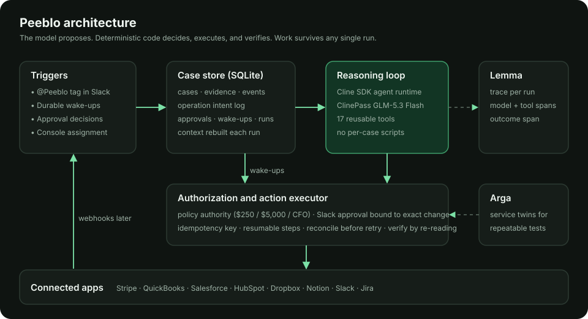
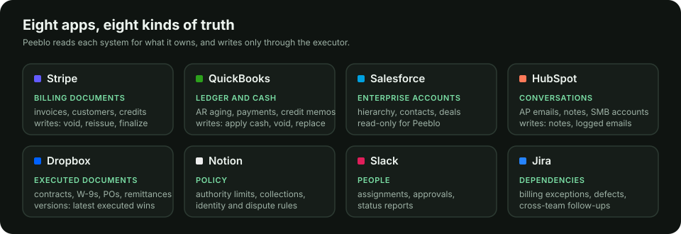
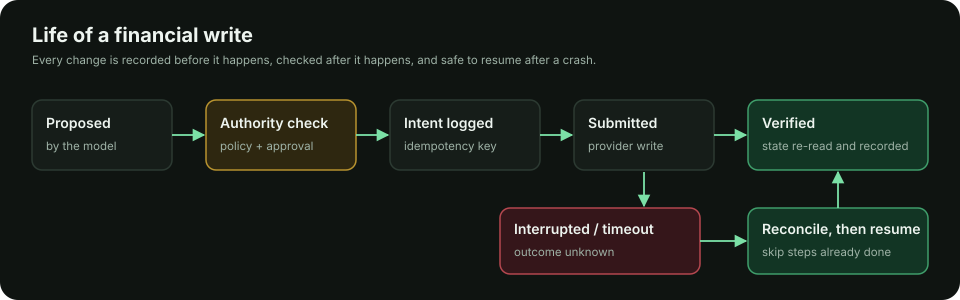

# Peeblo

**An accounts receivable teammate that owns billing exceptions across your finance and business stack, and keeps working until each case reaches a verified outcome.**

Tag `@Peeblo` in Slack with a problem like *"Eastbridge still hasn't paid their Q3 invoice"*. Peeblo investigates across Stripe, QuickBooks, Salesforce, HubSpot, Dropbox, Notion and Jira. It checks policy, asks for approval when a change needs it, makes the correction, verifies the result in every system it touched, and reports back. If it is interrupted mid-correction, it resumes without duplicating anything.

- **Demo (2 min):** _link to video_
- **Live console:** https://peeblo.xyz/room
- **Agent API:** https://api.peeblo.xyz/api/health

---

## Why

A signed deal turns into an overdue invoice. The reason is scattered: the invoice is in Stripe, AP's rejection is in an email, the correct legal entity is in a contract in Dropbox, the ledger is in QuickBooks, and the rule for fixing it is in a policy doc. An AR analyst spends hours stitching that together. Peeblo does the stitching, and it follows through.

## How it works



| Layer | What it does |
|---|---|
| **Triggers** | A signed Stripe webhook (deduplicated by event ID), a Slack `@Peeblo` mention (Socket Mode), a durable wake-up (for example "day after the promised payment date"), an approval decision, or an assignment from the console. Duplicate events resume the same case. |
| **Case store** | SQLite holds cases, evidence, the operation intent log, approvals, wake-ups and every run event. Model sessions are disposable, and each run rebuilds its context from these records. |
| **Reasoning loop** | [Cline SDK](https://docs.cline.bot/sdk/overview) agent runtime on ClinePass **GLM-5.3 Flash**. It gets the standing responsibility, the case state and 17 reusable tools. There are no per-case scripts: the same agent handles a wrong entity, an "already paid" claim or a missing PO. |
| **Executor** | Deterministic code between the model and the apps. It enforces authority from policy, requests Slack approval bound to the exact change, logs intent with an idempotency key before writing, reconciles uncertain outcomes before retrying, and verifies by re-reading provider state. |
| **Observability** | Every run is one [Lemma](https://uselemma.ai) trace with a span for each model turn and tool call, plus an outcome span (status, verified operations, pending approvals). |
| **Testing** | [Arga](https://argalabs.com) service twins for repeatable scenario tests (see Reliability). |

**Tools the agent chooses from**

- **Read:** `find_customer`, `get_billing_state`, `find_invoice`, `ar_worklist`, `get_crm_context`, `get_conversations`, `read_policy`, `search_documents`, `read_document`, `search_jira`, `read_slack`
- **Case:** `update_plan` (persistent plan shown in the console), `record_evidence`, `schedule_follow_up`, `propose_lesson`, `finish_run`
- **Change** (through the executor only): `propose_action`, `retry_operation`

**Actions the executor can perform** (authority comes from the Notion policy)

| Action | Authority |
|---|---|
| `billing.reissue_to_correct_entity`: void the wrong invoice and reissue to the correct entity in Stripe and QuickBooks, resumable per step | AR approver |
| `stripe.void_invoice`, `qbo.void_invoice`, `stripe.create_invoice` (as replacement) | AR approver |
| `stripe.create_credit_note`, `qbo.create_credit_memo` | ≤ $250 autonomous · ≤ $5,000 AR approver · above that, CFO |
| `qbo.apply_payment` (same customer, balance-checked) | autonomous |
| `stripe.update_draft_invoice` (e.g. add PO), `stripe.finalize_invoice`, `stripe.create_customer`, `qbo.create_customer`, `qbo.create_invoice` | autonomous |
| `customer.send_email` | approved templates autonomous; anything that commits money needs approval |
| `hubspot.log_note`, `jira.comment`, `jira.create_issue`, `slack.post` | autonomous |

## Connected apps



| App | Role for Peeblo | Access |
|---|---|---|
| **Stripe** | Issued invoices, customers, subscriptions, credit notes | Secret key (test mode) |
| **QuickBooks Online** | Ledger: AR aging, payments, credit memos | OAuth 2.0 (rotating refresh token, persisted) |
| **Salesforce** | Enterprise accounts, parent/child hierarchy, contacts, opportunities with contract terms | External Client App, client credentials |
| **HubSpot** | Customer billing conversations (AP emails, notes), SMB accounts | Service key |
| **Dropbox** | Executed contracts, billing instructions, W-9s, POs, remittances, with version history | Scoped app, offline refresh token |
| **Notion** | Approved policies: authority limits, collections, identity and cash application, disputes | Internal integration |
| **Slack** | Assignments, approvals (buttons), status reports | Bot + app token (Socket Mode) |
| **Jira** | Billing exceptions and cross-team dependencies | API token |

## The demo case, as Peeblo actually runs it

1. **Stripe/QuickBooks:** INV-2310, $24,000, is open and overdue, addressed to **Eastbridge Holdings**.
2. **HubSpot:** Eastbridge Logistics AP rejected it because it names the parent company.
3. **Salesforce:** there are two similarly named accounts (Holdings, and Logistics as its child). A lookalike, *East Bridge Coffee Roasters*, is rejected.
4. **Dropbox:** the billing instructions have two versions. v1 (2025) says bill Holdings; the executed v2 (2026) says bill **Eastbridge Logistics LLC, EIN 84-2917365**, and supersedes v1.
5. **QuickBooks:** no payment or credit has been applied.
6. **Notion:** voiding and reissuing requires AR approver approval, so Peeblo posts the exact correction with evidence to `#ar-approvals`.
7. **Approved:** Stripe void, then the replacement invoice for Logistics. **Interrupted.**
8. **Resume:** the executor finds the replacement it already created (idempotency key). No duplicate. It continues in QuickBooks, then verifies balances and references.
9. **Jira and Slack:** the exception is updated and a report goes back to Slack. **Billing exception resolved; receivable stays open** until payment arrives.

The same agent and tools also run the other seeded cases (see Reliability).

## What Peeblo can do

One standing responsibility, many situations. Status reflects this build, tested against the seeded sandbox apps.

| Responsibility (from the product spec) | Status |
|---|---|
| Repair incorrect billing identities (void and reissue to the right legal entity) | ✅ demonstrated, including interruption recovery |
| Investigate "already paid" claims and apply incoming cash, including payments made on behalf of others | ✅ demonstrated |
| Handle partial and grouped payments; short-pays routed to approval, never written off silently | ✅ demonstrated |
| Resolve missing purchase orders (hold the invoice, follow up) | ✅ demonstrated |
| Coordinate disputes and billing defects with Jira; report in Slack | ✅ demonstrated |
| Track promises to pay and follow-ups with durable wake-ups | ✅ supported (scheduler + wake-ups in every case) |
| Validate draft invoices against contracts; add PO numbers; finalize | ✅ supported by tools and actions |
| Prepare credits and credit notes within authority | ✅ supported, approval-gated by amount |
| Find deals that never became invoices; prepare new customers | ✅ supported (CRM + Stripe tools, create customer/invoice actions) |
| Detect Stripe ↔ QuickBooks sync failures and duplicates | 🟡 tools read both sides; seeded cases exist, not yet run |
| Answer billing questions, prepare statements, prioritize collections, daily AR briefing | 🟡 read tools exist (`ar_worklist`, conversations, ledger); templates are logged, not emailed |
| Customer portals (Coupa, Ariba), bank feeds, usage metering | ⏳ planned connectors (browser agent for portals) |

The seeded world has 50 accounts across the apps, including deliberate lookalikes (Eastbridge vs East Bridge Coffee, Ridgeview school district vs Ridgeview Capital, Northwind Group vs Northwind Traders), superseded documents, expired POs, a duplicate QuickBooks invoice, a Stripe payment missing from the ledger, and a disputed usage charge.

## Reliability



**Guarantees built into the executor**

- **Authority is not the model's decision.** Thresholds and approval requirements are code, mirroring the Notion policy. An approval covers a fingerprint of the exact action and parameters, expires after 48h, and only listed approvers count.
- **No duplicate writes.** Every write has a business-identity idempotency key (for example customer + invoice reference + replaced invoice), so a resumed run that phrases things differently still maps to the same operation.
- **Interruption is a normal state.** An operation left `submitted` or `uncertain` is reconciled against provider state before anything is retried. Multi-step corrections skip steps already done.
- **Verified, not assumed.** After each write the executor re-reads Stripe/QuickBooks/HubSpot/Jira and records what it observed; the case timeline shows it.
- **Honest outcomes.** "Billing exception resolved" and "receivable settled" are separate. Runs must end with an explicit status, summary and next action.

**Test results**

_Filled from actual runs; see `agent/src/e2e.ts` and the Lemma traces._

| Scenario (same agent, no case-specific code) | Expected end state | Result |
|---|---|---|
| Eastbridge: wrong bill-to entity, approval, interrupted mid-correction, resume | Stripe original void and one replacement to Logistics; QuickBooks original $0 and one replacement for Logistics; no duplicates; Jira and Slack updated | ✅ **Pass.** The agent chose the correction and requested approval itself. The run was interrupted after the Stripe replacement; on resume the executor skipped completed steps and finished QuickBooks. Verified: Stripe original `void`, one replacement INV-2310 `open` to Eastbridge Logistics LLC $24,000; QuickBooks original $0, INV-2310-R to Eastbridge Logistics, balance $24,000. Case left `waiting` (receivable open) with a follow-up scheduled. |
| Crescent Dental: "we already paid", payment from a different payer | $12,600 applied to INV-2296 only after matching the remittance | ✅ **Pass.** Found the $12,600 ACH parked under CDG Partners LLC, proved the payer relationship from the remittance advice and the order form clause, allocated it (verified: INV-2296 balance $0, deposit preserved across 2 payments, $0 unapplied), confirmed to the customer and the team. Status `resolved`. |
| Northwind: grouped wire from the parent for three affiliates, $450 short-pay | Affiliate invoices paid, $8,550 applied to INV-2242, $450 credit sent for approval (not written off) | ✅ **Pass, after an honest escalation.** First run: applied the parent's own $8,550, sent the $450 credit for approval (training priced $1,350 in the Enterprise Agreement), and hit an executor limitation (allocation refused a partly-applied payment). Instead of forcing a write it **filed Jira SCRUM-16 describing the gap** and waited. After the fix, the resumed run retried the recorded operation: INV-2240 $18,000 → $0, INV-2241 $15,000 → $0, $0 unapplied, SCRUM-16 updated. Status `waiting` on the $450 approval. |
| Meridian: renewal draft without PO, asked "can it go out today?" | Invoice not finalized; follow-up scheduled for PO date | ✅ **Pass.** Declined to send: contract and policy require a PO, the only PO on file is last year's and expired. Informed the team and scheduled a wake-up for the date procurement promised. Status `waiting`. |

**Outcome evaluation (`npm run eval`).** ArgaBench-style executable checks read live Stripe and QuickBooks state after Peeblo worked the cases, plus invariants over the operation log. Results: [`docs/eval-results.md`](docs/eval-results.md).

| Run | Result |
|---|---|
| First run | 15/16. Found a real defect: an operation from before the precondition fix was still marked `uncertain` on a resolved case. |
| After reconciling | **16/16.** The executor's retry re-read QuickBooks, saw the $12,600 was already applied and refused to apply it again. |

Checks cover outcomes (correct entity, balances, preserved deposits), forbidden changes (lookalike invoices untouched, no credit without approval, no invoice sent without a PO) and harness invariants (no operation executed twice, every gated write had an approved approval, every write has a recorded verification).

**Arga (service twins).** `agent/src/arga-test.ts` runs the executor against a Stripe twin with injected faults. Pass criteria are read back from the twin.

| Twin run | What is tested | Result |
|---|---|---|
| `0c323cd4` | Approved void + reissue where **the provider accepts the create but the response is lost** | ✅ Operation marked `uncertain`, reconciled on retry, no duplicate; a rephrased retry maps to the same operation. [Recording](docs/evidence/arga-stripe-twin-interrupted-reissue.mp4) · [report](docs/evidence/arga-stripe-twin-report.json) |
| `67a12b23` | **Duplicate event delivery** and a **stale approval** (invoice paid while the void was awaiting approval) | ✅ Second delivery dropped; both map to one case; one customer created; approved void refused because the invoice is now paid. [Recording](docs/evidence/arga-stripe-twin-duplicate-and-stale-approval.mp4) · [report](docs/evidence/arga-stripe-twin-duplicate-and-stale-report.json) |

**Event triggers.** Stripe webhooks (`invoice.payment_failed`, `invoice.overdue`, `invoice.marked_uncollectible`, `charge.dispute.created`) are signature-verified, deduplicated by event ID and open one case per invoice and event type with no human tag. Verified on the live endpoint: first delivery opened a case and started a run, the duplicate was ignored, a forged signature was rejected with 400.

Twin limitation found: the Stripe twin did not apply invoice-item amounts (totals remained $0), so amount assertions run against the real Stripe sandbox instead, where the eval verifies $24,000.

**Lemma (execution traces).** Every run is one trace in the `MultiAgent` project: a generation span per model turn (model, timing, token usage), a tool span per tool call (input, output, error status) and a `verify-outcome` span. The first Eastbridge run produced 48 spans (13 model turns, 33 tool calls). Lemma's issue detection flagged a real failure on its own, **"read_document used nonexistent path"** (the agent guessed a Dropbox path before searching), which led to the search fallback now in `search_documents`.

**Known limitations**

- The sandbox date for Stripe due dates cannot be backdated (Stripe requires future due dates without test clocks), so Stripe shows the Aug 1 invoice with its Net 30 terms written on it, and QuickBooks carries the overdue aging.
- Customer email is recorded as an outbound email on HubSpot rather than sent (no mail connector).
- Scheduling uses a SQLite wake-up table polled every 15s instead of Temporal; state is durable but a single worker processes runs.
- Webhooks are wired for Stripe; QuickBooks, HubSpot and Jira events still arrive through scheduled reviews.

## Setup

**Requirements:** Node 24+ (runs TypeScript directly), accounts or sandboxes for the eight apps, a ClinePass API key, and a Lemma project.

```bash
git clone https://github.com/hitakshiA/peeblo && cd peeblo
cp .env.example ../.env          # credentials live outside the repo; see the list in .env.example
cd agent && npm ci

node ../seed/apps/stripe.ts       # seed the Miny Labs world (idempotent)
node ../seed/apps/lite.ts         # QuickBooks, Salesforce, HubSpot, Slack, Jira, Notion, Dropbox
node ../seed/scenarios/eastbridge.ts   # set up or reset the demo case

node src/main.ts                  # API :8787, Slack Socket Mode, scheduler
node src/cli.ts assign "Crescent Dental says they already paid INV-2296"   # or run a case from the terminal
node src/e2e.ts                   # end-to-end test: approval, interruption, resume
```

Frontend: `cd frontend && npm ci && VITE_PEEBLO_API=http://localhost:8787 npm run dev`, then open `/room`.

**Deploy:** the agent runs on an Azure VM as a systemd service behind Caddy (`api.peeblo.xyz`); the frontend is on Vercel (`peeblo.xyz`).

## Repository

```
agent/src/   main.ts (Slack, scheduler, API)  runner.ts (Cline agent + Lemma)  tools.ts  executor.ts  store.ts  connectors.ts  bus.ts
seed/        world/ (shared business world)  apps/ (per-app seeders)  scenarios/ (resettable demo cases)
frontend/    src/room/ (live case console)
docs/        diagrams
```
