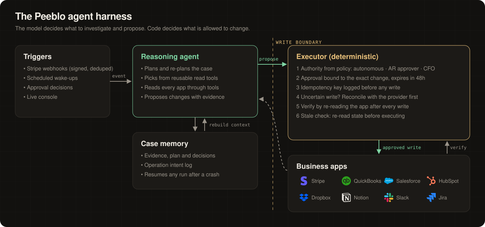

<p align="center"></p>

<p align="center">
  <a href="https://peeblo.xyz/demo.mp4"><b>▶ Demo video (2 min)</b></a> ·
  <a href="https://peeblo.xyz"><b>Live demo</b></a>
</p>

<p align="center"></p>

[](https://peeblo.xyz/demo.mp4)

<p align="center"><b>▲ Click the picture above to play the 2-minute demo video</b></p>

---

## The problem

- **B2B companies have cash stuck in receivables that nobody can collect**, even when the customer wants to pay.
- The invoice isn't disputed. It's **wrong**: billed to the parent instead of the subsidiary, missing a PO, or paid by a third party the ledger doesn't recognize.
- The answer is always in the data, but it's **split across five or more tools**: billing, ledger, CRM, inbox, contracts, policies.
- So finance teams burn **hours per exception** reconstructing context, then make money-moving changes by hand, where one mistake means a duplicate invoice or a wrong write-off.
- Existing AR automation sends reminders. **Nobody fixes the exception.**

## What Peeblo is

- **Peeblo is the AR teammate that fixes billing exceptions end to end.** It investigates across your finance and business apps, proposes the fix, gets approval, executes it and proves the result.
- **It's a specialized agent harness, not a chatbot.**
  - The model does the detective work.
  - A deterministic executor controls every dollar: approval limits, no duplicate writes, crash recovery, verification.
- **One agent, many situations.** The same agent, with no case-specific code, has fixed a wrong bill-to entity, matched an "already paid" claim to a third-party payment, split a short-paid grouped wire, and refused to send an invoice without a PO.
- **It tells the truth about outcomes.** "Billing error fixed" and "cash collected" are different states, and Peeblo reports both.

## The Peeblo agent harness



| Question | Answer | Code |
|---|---|---|
| What wakes it? | Signed Stripe webhooks (deduplicated by event ID), scheduled wake-ups, approval decisions, the live console | [`main.ts`](agent/src/main.ts) |
| What does the model decide? | What to read, which entity is correct, what change to propose, when to escalate or wait | [`tools.ts`](agent/src/tools.ts), [`runner.ts`](agent/src/runner.ts) |
| What does code decide? | Whether a change is allowed, who must approve it, and whether it already happened | [`executor.ts`](agent/src/executor.ts) |
| How is approval bound? | A fingerprint of the exact action and parameters. It expires in 48h, and only listed approvers count. | `requestApproval`, `decide` |
| What survives a crash? | Case evidence, the plan, and an intent log written **before** every external write | [`store.ts`](agent/src/store.ts) |
| Response lost after a write? | The operation is marked `uncertain` and reconciled against the provider before any retry | `retry` in executor.ts |
| When is a write "done"? | Only after the executor re-reads Stripe, QuickBooks, HubSpot or Jira and records what it saw | `finish` in executor.ts |

## How Peeblo connects to each app


- **Stripe:** finds the issued invoice; voids it and creates the replacement.
- **QuickBooks:** reads the ledger and balances; voids, reissues, applies payments.
- **Salesforce:** tells the parent account apart from its subsidiaries by legal name and EIN.
- **HubSpot:** reads the customer's AP emails; records outbound notices.
- **Dropbox:** reads signed order forms and billing instructions, including version history.
- **Notion:** reads the AR policies that set approval limits.
- **Slack:** sends approval requests with the evidence; posts status updates.
- **Jira:** tracks the billing exception and cross-team follow-ups.

## See it work: an invoice sent to the wrong company

**The situation:** our seeded customer Eastbridge has two similarly named companies, **Eastbridge Holdings** (the parent) and **Eastbridge Logistics** (the subsidiary that signed the contract). A $24,000 quarterly invoice went to the parent. Logistics' AP team rejected it, and it has been overdue since.

**What Peeblo had to work out, with no hints:**
- Which of the two similar accounts actually signed. There's also a lookalike, *East Bridge Coffee Roasters*.
- Which of two billing-instruction documents is current: an older one says bill the parent, the executed one says bill Logistics.
- Whether any payment or credit already exists, and what the policy requires before voiding an issued invoice.

| Before | After (verified by re-reading each app) |
|---|---|
| Stripe invoice INV-2310, $24,000, **open**, billed to the **parent** | Original **void**; exactly **one** replacement, billed to the **subsidiary** |
| QuickBooks carries the same wrong invoice | Original zeroed; replacement for the subsidiary, balance $24,000 |
| AP rejection sitting in an email | Jira exception updated; team notified in Slack |

- **Approval:** company policy requires approval to void and reissue, so Peeblo requested it with the evidence attached.
- **Interruption test:** the harness injected an interruption right after the new Stripe invoice was created. On resume, Peeblo found the invoice it had already made, created **no duplicate**, and finished QuickBooks.
- **Honest ending:** the case ends `waiting`. The billing error is fixed; the $24,000 is still owed until the customer pays.

## Run it locally

```bash
git clone https://github.com/hitakshiA/peeblo && cd peeblo
cp .env.example ../.env                 # fill in sandbox credentials (kept outside the repo)
cd agent && npm ci

node ../seed/apps/stripe.ts             # seed the business world (idempotent)
node ../seed/apps/lite.ts               # QuickBooks, Salesforce, HubSpot, Slack, Jira, Notion, Dropbox
node ../seed/scenarios/eastbridge.ts    # set up / reset the demo case

node src/main.ts                        # terminal 1: API + scheduler
node src/e2e.ts                         # terminal 2: approval → interruption → resume
```

Frontend: `cd frontend && npm ci && VITE_PEEBLO_API=http://localhost:8787 npm run dev`, then open `/room`.

```
agent/src/   main.ts · runner.ts (Cline agent) · tools.ts · executor.ts · store.ts · connectors.ts
seed/        world/ (shared business world) · apps/ (per-app seeders) · scenarios/ (resettable cases)
frontend/    src/room/ (live case console)
docs/        demo.mp4 · assets/
```
