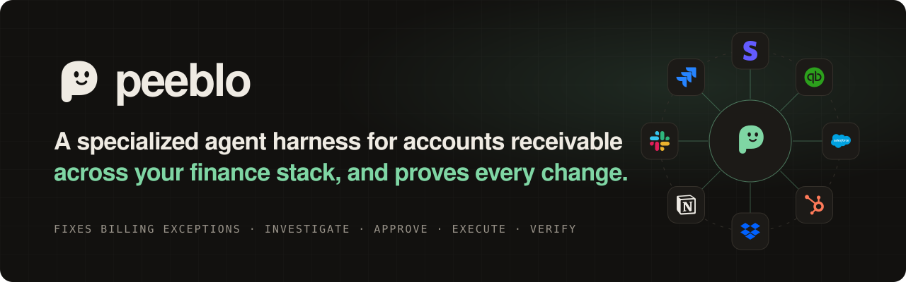
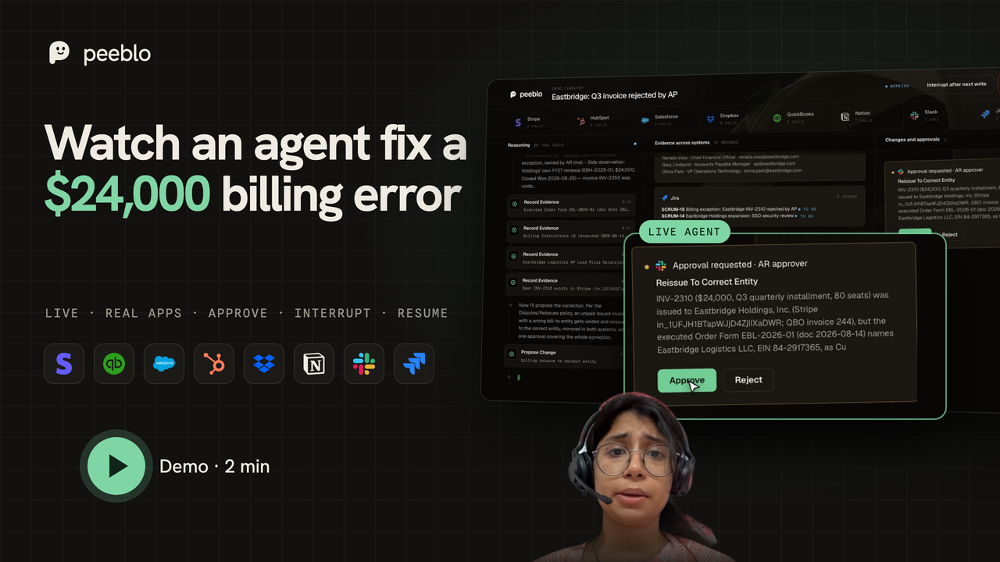
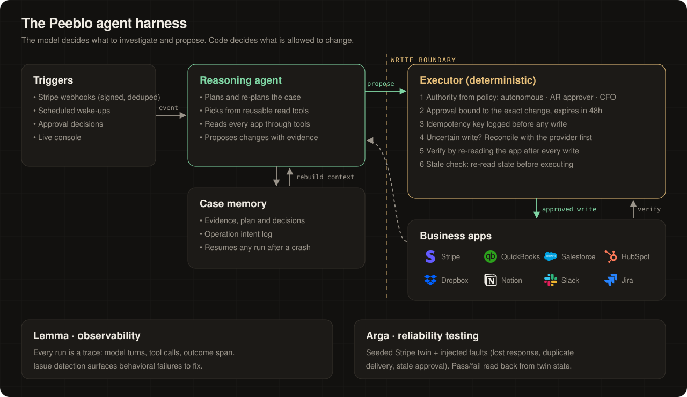
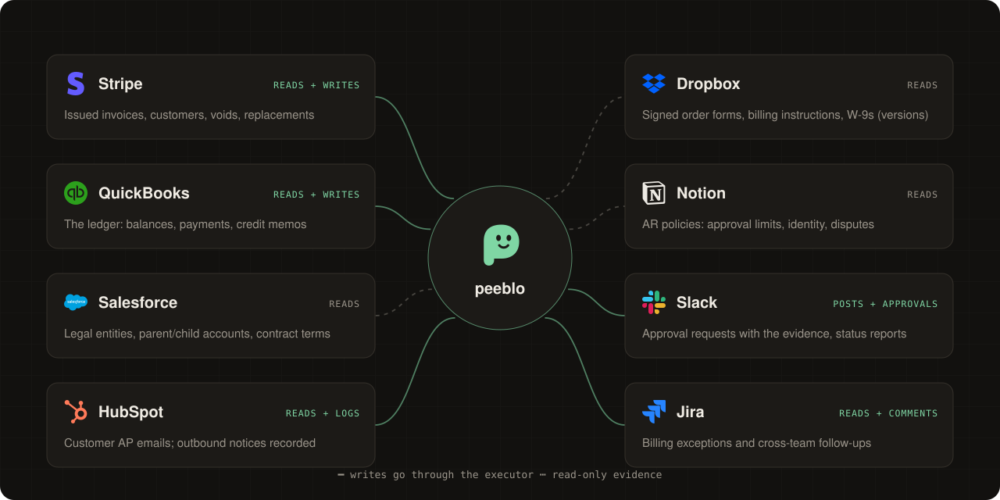
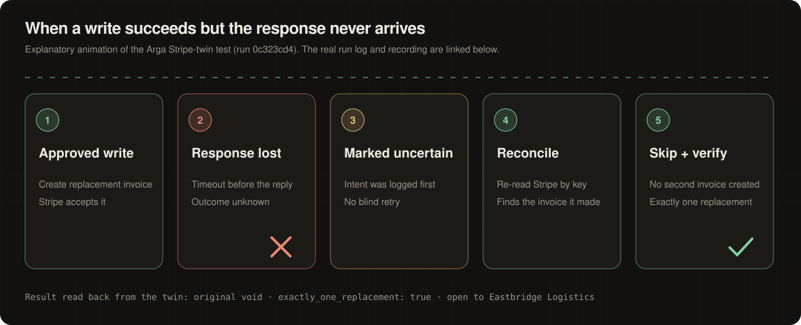
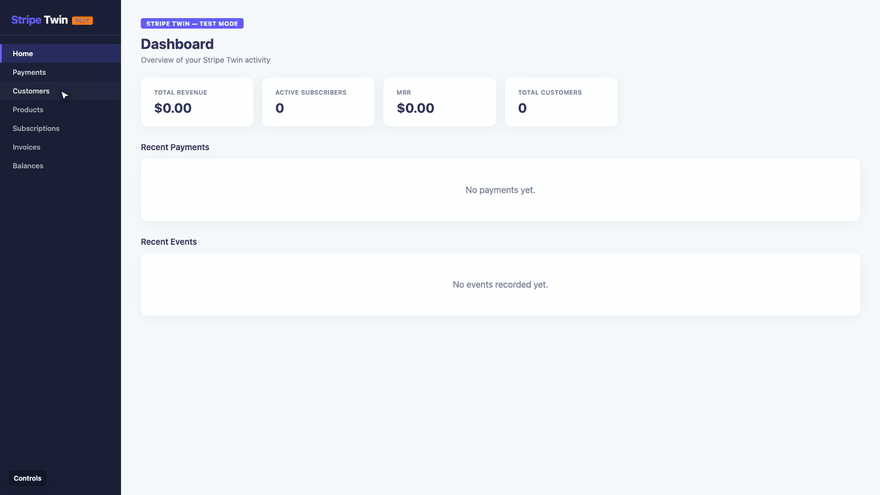
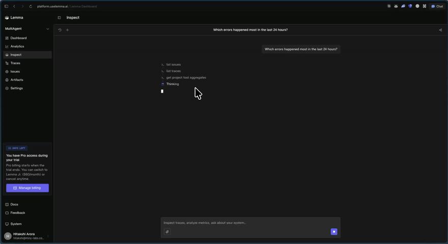

<p align="center"></p>

<p align="center">
  <a href="https://peeblo.xyz/demo.mp4"><b>▶ Demo video (2 min)</b></a> ·
  <a href="https://peeblo.xyz/room"><b>Live demo</b></a> ·
  <a href="https://api.peeblo.xyz/api/health">Agent API</a> ·
  <a href="seed/">Seed data</a> ·
  <a href="#reliability">Reliability results</a> ·
  <a href="docs/eval-results.md">Eval report</a>
</p>

> **The live demo runs a real agent.** Every case at [peeblo.xyz/room](https://peeblo.xyz/room) is worked by GLM-5.3 Flash (ClinePass, via the Cline SDK) against real sandbox accounts in Stripe, QuickBooks, Salesforce, HubSpot, Dropbox, Notion, Slack and Jira. Nothing on screen is scripted. The accounts are filled with a seeded business world from [`seed/`](seed/).

<p align="center"></p>

[](https://peeblo.xyz/demo.mp4)

<p align="center"><b>▲ Click the picture above to play the 2-minute demo video</b></p>

---

## The problem

- **B2B companies have cash stuck in receivables that nobody can collect**, even when the customer wants to pay.
- The invoice isn't disputed. It's **wrong**: billed to the parent instead of the subsidiary, missing a PO, or paid by a third party the ledger doesn't recognize.
- The answer is always in the data, but it's **split across five or more tools**: billing, ledger, CRM, inbox, contracts, policies.
- So finance teams burn **hours per exception** reconstructing context, then make money-moving changes by hand, where one mistake means a duplicate invoice or a wrong write-off.
- Existing AR automation sends reminders. **Nobody fixes the exception.**

## What Peeblo is

- **Peeblo is the AR teammate that fixes billing exceptions end to end.** It investigates across your finance and business apps, proposes the fix, gets approval, executes it and proves the result.
- **It's a specialized agent harness, not a chatbot.**
  - The model does the detective work.
  - A deterministic executor controls every dollar: approval limits, no duplicate writes, crash recovery, verification.
- **One agent, many situations.** The same agent, with no case-specific code, has fixed a wrong bill-to entity, matched an "already paid" claim to a third-party payment, split a short-paid grouped wire, and refused to send an invoice without a PO.
- **It tells the truth about outcomes.** "Billing error fixed" and "cash collected" are different states, and Peeblo reports both.

## The Peeblo agent harness



| Question | Answer | Code |
|---|---|---|
| What wakes it? | Signed Stripe webhooks (deduplicated by event ID), scheduled wake-ups, approval decisions, the live console | [`main.ts`](agent/src/main.ts) |
| What does the model decide? | What to read, which entity is correct, what change to propose, when to escalate or wait | [`tools.ts`](agent/src/tools.ts), [`runner.ts`](agent/src/runner.ts) |
| What does code decide? | Whether a change is allowed, who must approve it, and whether it already happened | [`executor.ts`](agent/src/executor.ts) |
| How is approval bound? | A fingerprint of the exact action and parameters. It expires in 48h, and only listed approvers count. | `requestApproval`, `decide` |
| What survives a crash? | Case evidence, the plan, and an intent log written **before** every external write | [`store.ts`](agent/src/store.ts) |
| Response lost after a write? | The operation is marked `uncertain` and reconciled against the provider before any retry | `retry` in executor.ts |
| When is a write "done"? | Only after the executor re-reads Stripe, QuickBooks, HubSpot or Jira and records what it saw | `finish` in executor.ts |

## How Peeblo connects to each app



- **Stripe:** finds the issued invoice; voids it and creates the replacement.
- **QuickBooks:** reads the ledger and balances; voids, reissues, applies payments.
- **Salesforce:** tells the parent account apart from its subsidiaries by legal name and EIN.
- **HubSpot:** reads the customer's AP emails; records outbound notices.
- **Dropbox:** reads signed order forms and billing instructions, including version history.
- **Notion:** reads the AR policies that set approval limits.
- **Slack:** sends approval requests with the evidence; posts status updates.
- **Jira:** tracks the billing exception and cross-team follow-ups.

## See it work: an invoice sent to the wrong company

**The situation:** our seeded customer Eastbridge has two similarly named companies, **Eastbridge Holdings** (the parent) and **Eastbridge Logistics** (the subsidiary that signed the contract). A $24,000 quarterly invoice went to the parent. Logistics' AP team rejected it, and it has been overdue since.

**What Peeblo had to work out, with no hints:**
- Which of the two similar accounts actually signed. There's also a lookalike, *East Bridge Coffee Roasters*.
- Which of two billing-instruction documents is current: an older one says bill the parent, the executed one says bill Logistics.
- Whether any payment or credit already exists, and what the policy requires before voiding an issued invoice.

| Before | After (verified by re-reading each app) |
|---|---|
| Stripe invoice INV-2310, $24,000, **open**, billed to the **parent** | Original **void**; exactly **one** replacement, billed to the **subsidiary** |
| QuickBooks carries the same wrong invoice | Original zeroed; replacement for the subsidiary, balance $24,000 |
| AP rejection sitting in an email | Jira exception updated; team notified in Slack |

- **Approval:** company policy requires approval to void and reissue, so Peeblo requested it with the evidence attached.
- **Crash test:** we killed the run right after the new Stripe invoice was created. On resume, Peeblo found the invoice it had already made, created **no duplicate**, and finished QuickBooks.
- **Honest ending:** the case ends `waiting`. The billing error is fixed; the $24,000 is still owed until the customer pays.

## Reliability

### Results

| Scenario or fault | Environment | Required / forbidden outcome | Result |
|---|---|---|---|
| Invoice sent to the wrong company, approval, **interrupted mid-correction** | Real Stripe + QuickBooks sandboxes | One replacement for Logistics; original void; no duplicate customer | ✅ Pass ([eval](docs/eval-results.md)) |
| "Already paid" via a management company | QuickBooks sandbox | $12,600 applied to INV-2296; lookalike Ridgeview invoices **untouched** | ✅ Pass |
| Grouped wire across affiliates, $450 short-pay | QuickBooks sandbox | Affiliates paid; exactly $450 left open; **no credit without approval** | ✅ Pass, after an executor fix (below) |
| Renewal with no valid PO | Stripe sandbox | Invoice **not** sent; follow-up scheduled | ✅ Pass |
| **Write accepted, response lost** | Arga Stripe twin | Marked uncertain, reconciled, exactly one replacement | ✅ Pass · [log](docs/evidence/arga-stripe-twin-report.json) · [recording](docs/evidence/arga-stripe-twin-interrupted-reissue.mp4) |
| **Stale approval** (invoice paid while void awaited approval) | Arga Stripe twin | Approved void refused because the invoice is now paid | ✅ Pass · [log](docs/evidence/arga-stripe-twin-duplicate-and-stale-report.json) |
| **Duplicate event delivery** | Arga Stripe twin | Both deliveries map to one case; one customer created | ✅ Pass · same log |

**Repeat trial from a clean reset (Sep 13, 22:22 UTC):**
- Reset the wrong-company scenario, then ran the full agent (investigate, then approval, then a forced interruption, then resume), then re-ran the checks against live Stripe and QuickBooks.
- Trial 1: **8/8 checks passed.** That covers exactly one replacement, the original void, no duplicate customer, and every write approved and verified.
- The agent took 15.5 minutes end to end. Trials 2 and 3 are in progress.

**How to read these numbers:**
- **16/16** is checks, not runs. [`npm run eval`](agent/src/eval.ts) reads live Stripe and QuickBooks state after the cases ran, plus invariants over the operation log:
  - no operation succeeded twice
  - every gated write had an approval
  - every write carries a verification
- **The first eval run scored 15/16.** It caught a stale `uncertain` operation on a resolved case. Retrying it re-read QuickBooks, saw the payment was already applied, and refused to apply it again.
- **Northwind:** the first run hit an executor gap (allocating from a partly applied payment). The agent didn't force a write. It **filed Jira SCRUM-16** describing the gap and waited. After the fix, the resumed run completed the recorded operation.

### Recovery, step by step



## How I used Arga



- **Seeded twin:** [`arga-test.ts`](agent/src/arga-test.ts) provisions an Arga **Stripe twin** and seeds the failure state: parent and subsidiary customers, plus an issued invoice billed to the wrong one.
- **Real executor:** the unmodified executor runs against the twin by pointing the Stripe base URL at it.
- **Injected faults:** a lost response after `create_invoice`, the same event delivered twice, and the customer paying while a void awaited approval.
- **Grading:** pass/fail comes from the twin's own state (the admin state API and invoice lists), not from Peeblo's logs.
- **Something we learned:** the twin ignored invoice-item amounts (totals stayed $0), so dollar-amount assertions run in the real Stripe sandbox instead.

## How I used Lemma



```ts
import { Lemma } from "@uselemma/tracing";
const lemma = new Lemma({ apiKey, projectId, release: "peeblo-agent@0.1.0" });

const trace = lemma.trace({ name: "peeblo-case-run", input: { case_id, trigger } });
const turn  = trace.startGeneration({ name: `turn-${i}`, model: "cline-pass/glm-5.3-flash" });   // every model turn
const tool  = trace.startTool({ name: toolName, input });                                        // every tool call
tool.end({ output, status: isError ? "ERROR" : "OK" });
trace.recordSpan({ name: "verify-outcome", metadata: { "case.status": status, "operations.uncertain": n } });
```

- **Trace shape:** one trace per run, with a span for every model turn (tokens, timing) and every tool call (input, output, error status). A final `verify-outcome` span records what the case actually ended as.
- **Failure found → fixed:**
  - **Found:** Lemma's issue detection flagged **"read_document used nonexistent path"**. The agent was guessing Dropbox paths.
  - **Cause:** Dropbox search indexing lags, so search returned nothing for freshly seeded files.
  - **Fix:** `search_documents` now falls back to a folder listing, so the agent gets real paths. See [`tools.ts`](agent/src/tools.ts).
- **Other patterns Lemma surfaced:** "retry_operation repeated without progress" and "cross-customer payment application attempted". The executor refused those writes, and the traces showed the agent exactly where it looped. That led to precondition failures being returned as final (`PreconditionError`), so the agent stops retrying them.

## Run it locally

```bash
git clone https://github.com/hitakshiA/peeblo && cd peeblo
cp .env.example ../.env                 # fill in sandbox credentials (kept outside the repo)
cd agent && npm ci

node ../seed/apps/stripe.ts             # seed the business world (idempotent)
node ../seed/apps/lite.ts               # QuickBooks, Salesforce, HubSpot, Slack, Jira, Notion, Dropbox
node ../seed/scenarios/eastbridge.ts    # set up / reset the demo case

node src/main.ts                        # terminal 1: API + scheduler
node src/e2e.ts                         # terminal 2: approval → interruption → resume
npm run eval                            # outcome checks against live app state
```

Frontend: `cd frontend && npm ci && VITE_PEEBLO_API=http://localhost:8787 npm run dev`, then open `/room`.

```
agent/src/   main.ts · runner.ts (Cline agent + Lemma) · tools.ts · executor.ts · store.ts · connectors.ts
seed/        world/ (shared business world) · apps/ (per-app seeders) · scenarios/ (resettable cases)
frontend/    src/room/ (live case console)
docs/        demo.mp4 · assets/ · eval-results.md · evidence/ (Arga logs and recordings)
```
